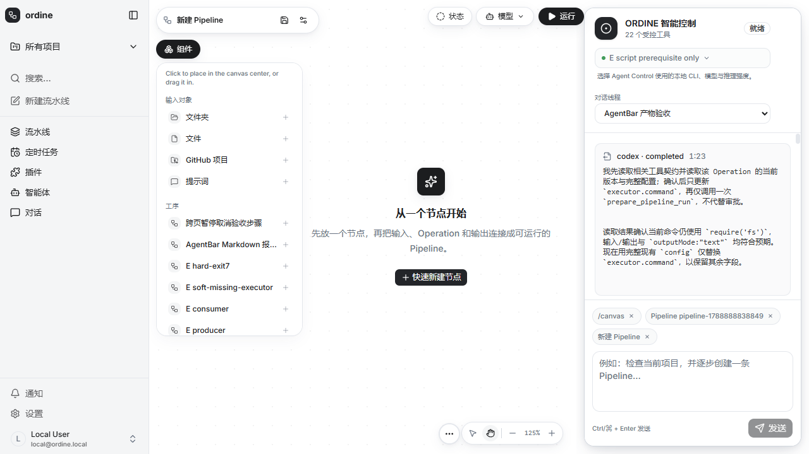

# Original product integration

The default Web and Native pages retain the existing navigation, Canvas, Operation editor, Jobs and global AgentBar. A named `execution` Refine provider binds these surfaces to the v2 API; legacy run endpoints return explicit errors rather than starting old runners.

## Execution boundaries

Canvas authoring is published to immutable typed definitions. Pipeline input IDs differ from Operation input IDs; saved Prompt values can be used without sending overrides. Preparation creates a persisted request, App approval binds fixed revisions and inputs, and only a successful Job with published artifacts constitutes file delivery.

Native owns the server process tree and credentials. Its single API origin hosts authoring metadata in an isolated schema alongside the v2 execution API. Web uses the existing authenticated session and an owner-restricted server proxy; it does not require an App token in the browser.

## Human-use defects corrected

- Homepage prompts are consumed by the current AgentBar after initialization, in a fresh conversation, rather than being left for an unmounted legacy panel.
- Starting a conversation clears historical execution state; resource creation within Canvas preserves the editor.
- Request cards use acknowledged execution receipts, not arbitrary tool-action IDs. Failed tools expose their real errors instead of polling nonexistent requests.
- Agent prompts and server validation explain typed input bindings and require Apply before preparation.
- Applying a Change Set after its Agent run finishes no longer returns an error after the transaction has already committed. Post-commit notification is best effort; the persisted Change Set and API response remain authoritative.

The change preserves the original visual design. See [acceptance boundaries](pipeline-v2-progress.md) for the verified Native flow and standalone Web gap.
