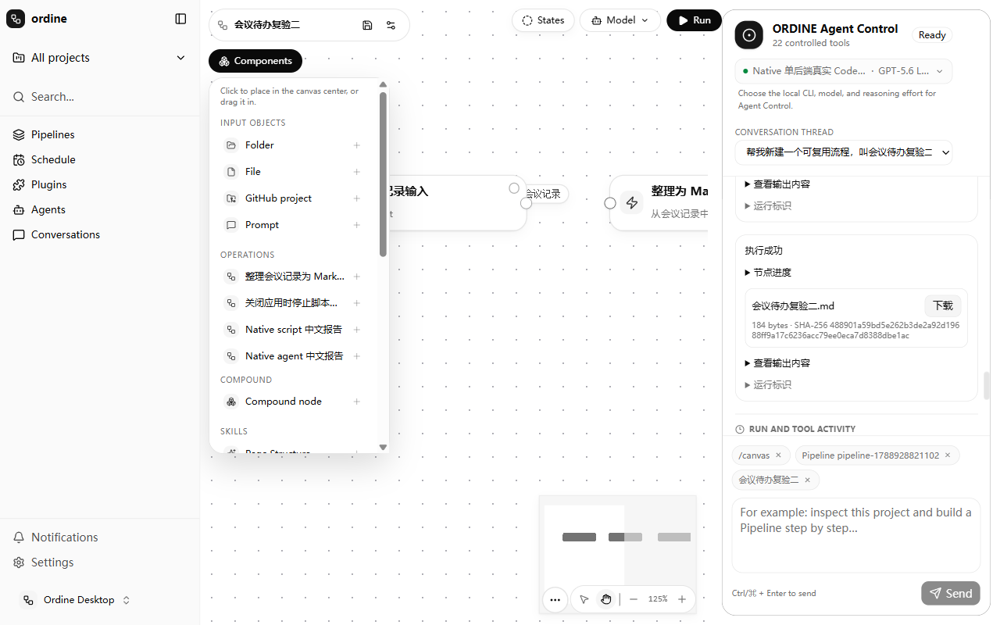

# Pipeline v2 implementation and acceptance

This breaking update routes Canvas, Operation, Jobs, Agent Control and CLI/MCP execution through immutable v2 definitions and persisted run requests. Original product navigation and AgentBar remain the primary interface. The separate execution workspace is an explicit development entry, not the homepage.

## Runtime contract

- Publish explicit typed ports, Operation revisions and graph bindings before preparation.
- Keep preparation, App approval, Job execution and verified artifact delivery distinct.
- Persist input snapshots, request identity, terminal state, execution attempts and artifact provenance.
- Use dedicated PostgreSQL targets; reject unsupported legacy execution contracts instead of silently translating them.
- Native owns one supervised backend and separate application/Agent credentials. Authoring metadata and execution storage use separate schemas.

## Validation before publication

On 2026-09-09, the Windows Native product completed a human-style acceptance sequence through the real UI: homepage demand, independent Agent conversation, plan confirmation, Canvas Apply, run approval, execution and file download. The same workflow then ran with different meeting text without revising the Pipeline or Operations. Both downloaded files contained the requested people, deadlines and notes; their hashes matched the published artifact records. Reinstall/restart preserved the workflow and downloads.

| Run                                | Bytes | SHA-256                                                          |
| ---------------------------------- | ----- | ---------------------------------------------------------------- |
| Initial meeting                    | 224   | e720f346f61e556e00c193ff969468f3cacc3347760585c6997c06aadb8afb5d |
| Reused workflow, different meeting | 184   | 488901a59bd5e262b3de2a92d19688ff9a17c6236acc79ee0eca7d8388dbe1ac |

The passing sequence had no browser console errors. No direct API or database mutation replaced user-facing business actions. Database reads after download corroborated Job/attempt/output-port provenance.

Root quality completed 21/21 tasks before integration with newer develop commits; Windows NSIS build/install and the Views suite (133 files, 563 tests) passed. The PR validation section records checks rerun after synchronization. Optional live suites and standalone Web deployment must not be inferred as passed from these results.

## Remaining acceptance boundary

Standalone Web bootstrap could not be reaccepted because local execution-service startup was blocked by automatic approval. Native acceptance does not establish standalone Web acceptance. No production migration or deployment was performed. Nested/compound execution remains outside this delivery.

## Integration with current develop

The branch includes #199, #200 and #201. Job lease columns and historical migration fixes are retained, terminal Agent event protection is shared with the upstream helper, and removed ownership/DSH tests remain removed. Retired execution endpoints stay disabled; selected runtime configuration is published through the v2 boundary instead of re-enabling the old runner.

Native authoring initialization now requires the 14-file migration chain through `0013_job_execution_leases.sql`. Its existing fingerprint checks intentionally reject an older preview schema; use a fresh dedicated target for this breaking preview. Automatic adoption or migration of previous preview data is not included.
